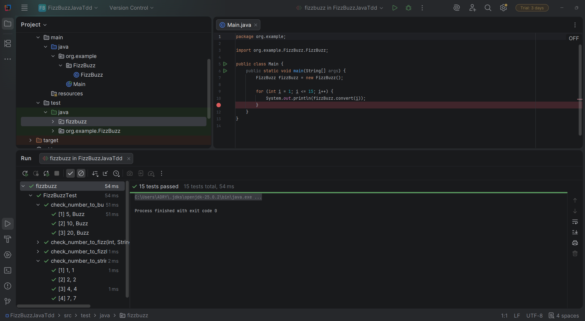

# FizzBuzz Java TDD

  
  

## Descripción
Este proyecto implementa la kata FizzBuzz usando TDD en Java.

## Reglas
- Si el número es múltiplo de 3, devuelve "Fizz".
- Si el número es múltiplo de 5, devuelve "Buzz".
- Si el número es múltiplo de 3 y 5, devuelve "FizzBuzz".
- En cualquier otro caso, devuelve el número como texto.

## Cómo Funciona
- `FizzBuzz.convert(int)` aplica las reglas y devuelve la cadena correcta.
- `Main` imprime el resultado para los números del 1 al 15.

## Pasos
1. Ejecutar los tests:
   - `mvn test`
2. Ejecutar la aplicación:
   - `mvn -q exec:java`

## Tests

